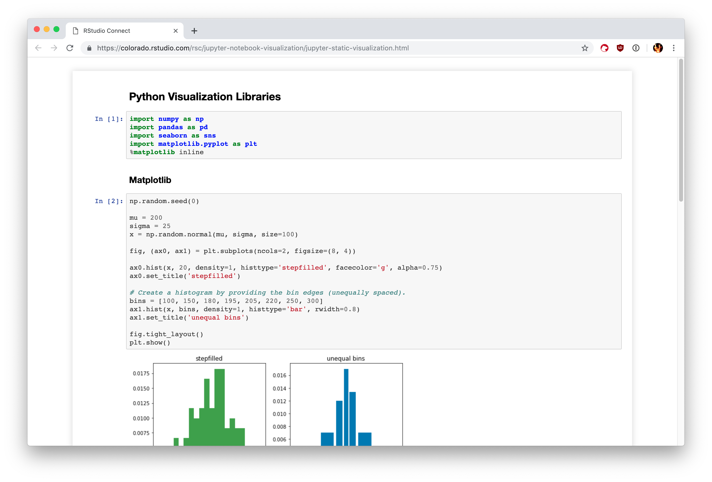

# Install Python

Go to https://www.python.org/downloads/

Select Python Version and OS (OS is automatically selected)

We will use Python 3.9.2 (but any version starting with 3 is okay!)

Include your python executable to your **$PATH** 

### To check if you've installed successfully

Open the terminal: 

- For MacOS press (cmd + space) then type "terminal" and press "Enter"
- For Windows Windows+R to open “Run” box, Type “cmd” and then click “OK”

After opening the terminal enter the following command:

> python --version

If you see a version number, then you've successfully installed Python. 

# Download get-pip.py

There are thousands of packages that we can use instead of writing the code from the scratch.

Installing and managing packages can be hard and cumbersome.

Pip helps us install and manage packages.

Download the following link.

https://bootstrap.pypa.io/get-pip.py (right click -> save as)

Note where you saved the get-pip.py file.

# Install Pip

Open the terminal again and navigate to the location where you saved **get-pip.py**.

You can use the following commands to navigate in a terminal (for Linux and MacOS):

- **cd**: Change Directory 
- **ls**: List the contents of current directory
- **pwd**: Print Working Directory (Current directory path)
- **cp**: Copy
- **mkdir**: Make Directory
- **mv**: Move

For example: If your **get-pip.py** file is in /Users/USERNAME/Downloads/ directory, then you can navigate there by typing the following command:
> **cd** /Users/USERNAME/Downloads

Once you've navigated to the correct directory run the following command:

> python get-pip.py

This will install Pip for us.

### To check if you've installed pip successfully

Open the terminal (if it's not already open)

Type the following command:

> pip --version

If you see a version number, then you've successfully installed Pip. 

# Jupyter Notebook

For every programming language, we need a platform to write and execute our code. 
These are called Integrated Development Environment (IDE)

There are many IDEs for different languages. For python we can use:

- IDLE
- PyCharm
- VSCode
- Spyder
- PyDev
- Atom
- etc.

However, my personal favorite is Jupyter Notebooks for couple of reasons:

- It runs on browser so you don't need additional UI.
- You can divide your code into multiple blocks and execute just the parts you want to.
- You can get intermediate results from the code, to check the validity.
- etc.

You can see a sample jupyter notebook environment below.

### To Install Jupyter Notebook

Open a terminal and execute the following command:

> pip install notebook

To check if you have successfully installed Jupyter Notebook, execute the following command:

> jupyter notebook

On Windows, if the above command does not work, try running the following command:

> python -m notebook

# Git

### Installing Git

First install git (if you haven't already.)

https://phoenixnap.com/kb/how-to-install-git-windows

Here is a step-by-step guide

You can use the following command to check if the installation was succesful.

> git --version

If you see a version, all is good!

### Using git to _clone_ the contents of repository

- First use terminal commands (cd, mkdir, etc..) to navigate to wherever you want to clone the repository. (mkdir makes a new directory)
	- Example: 
	-  cd /Users/mkemaltas/Desktop
	-  mkdir BilgeAdam
	-  cd BilgeAdam

- Then clone the repository by executing the following command

> git clone https://github.com/linkamusti/ba_python_subat.git

- After that, you should see a new folder named ba_python_subat. 

- To navigate into that folder you can either use the Windows File Explorer, or type in "cd ba_python_subat"

### _Pulling_ the updates from the repository

Whenever there's a change on the remote repository, you can pull the changes so that you have the most recent code.

- To do that you should first navigate to the folder (ba_python_subat) using terminal commands (cd)

- Then, to pull the changes to your local machine run the following command:

> git pull

- Everything should be up-to-date after doing so.

